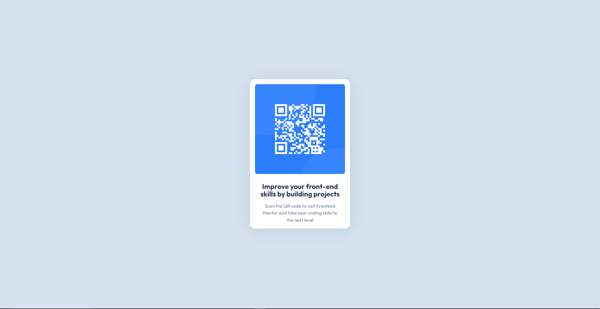

# Frontend Mentor - QR code component solution

This is a solution to the [QR code component challenge on Frontend Mentor](https://www.frontendmentor.io/challenges/qr-code-component-iux_sIO_H)

## Table of contents

- [Overview](#overview)
  - [Screenshot](#screenshot)
  - [Links](#links)
- [My process](#my-process)
  - [Built with](#built-with)
  - [What I learned](#what-i-learned)
  - [Continued development](#continued-development)
  - [Useful resources](#useful-resources)
- [Author](#author)
- [Acknowledgments](#acknowledgments)

**Note: Delete this note and update the table of contents based on what sections you keep.**

## Overview

This is a single page modal of a QR Code challenge by frontend mentor

### Screenshot

### Links

- Solution URL: [Add solution URL here](https://your-solution-url.com)
- Live Site URL: [Add live site URL here](https://your-live-site-url.com)

## My process

### Built with

- Semantic HTML5 markup
- CSS custom properties
- Flexbox

### What I learned

I learnt how to center a div (popular developer joke)
-Use relative unit as against fixed ones
-Create variables that are reusable as root components
-Also learnt how images behave, they could be a bit tricky but I soon got a hang of it.

### Continued development

I would love to continue developing a developers eye. That is using my eyes to examine items on a wwebsite and getting close to precise measurement along side improve my overall developement skill

## Author

- Website - [Add your name here](https://www.your-site.com)
- Frontend Mentor - [@bleuyogurt](https://www.frontendmentor.io/profile/Bleuyogurt)
